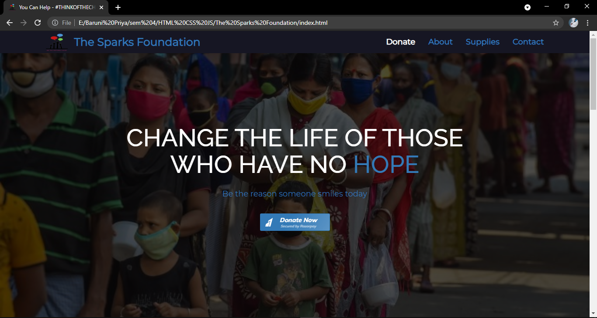

# Donation Website
This repository contains HTML, CSS & JS code for a donation website where the appropriate donation schemes are displayed and Razorpay is used for the payment integration. 

# Technologies
* Bootstrap
* Font Awesome
* Google Fonts
* Media Queries

# Specialities
* Razorpay payment gateway is used for making money transactions. 
* Back-to-top button is provided which is a shortcut icon that allows users to quickly navigate to the top of the page. 
* Hovering effects are applied to buttons and donation schemes.
* Tab logo is designed. 

# General Info 
* The webpage lands with a cover image, navigational bar at the top and a "Donate Now" button at the middle of the screen.  
* The webpage has various sections like about, supplies and contact sections.  
* The About section contains the motto of The Sparks Foundation to help children in this pandemic.  
* The Supplies section contains 4 donation schemes. It consists of list of items that the foundation will donate the needy people.  
* The Contact section contains a subscription button to subscribe to the newsletter and links to their social media accounts.  
* Clicking on the "Donate Now" button leads to the payment section which collects details like the amount to be donated and some personal details.  
* There are different methods for making transaction like Netbanking, UPI, etc. (test mode)  
* On successful payment, the donor will receive a payment receipt through the registered email.  

# Screenshot 

